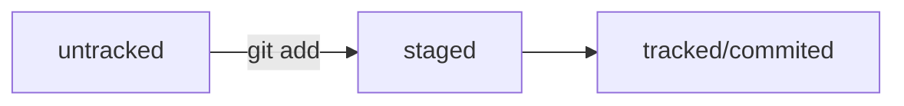

# Привет

Это файл README.md!

## Второй заголовок

## Клонирование чужого репозитория

git clone git@github.com:YandexPraktikum/first-project.git (от англ. clone, «клон», «копия») — склонируй репозиторий с URL first-project.git из аккаунта YandexPraktikum на мой локальный компьютер.

## Создание веток

git branch feature/the-finest-branch (от англ. branch, «ветка») — создай ветку от текущей с названием feature/the-finest-branch;

git checkout -b feature/the-finest-branch — создай ветку feature/the-finest-branch и сразу переключись на неё.

## Навигация по веткам

git branch (от англ. branch, «ветка») — покажи, какие есть ветки в репозитории и в какой из них я нахожусь (текущая ветка будет отмечена символом *);

git branch -a — покажи все известные ветки, как локальные (в локальном репозитории), так и удалённые (в origin, или на GitHub).

git checkout feature/br — переключись на ветку feature/br.

## Сравнение веток

git diff main HEAD (от англ. difference, «отличие», «разница») — покажи разницу между веткой main и указателем на HEAD;

git diff HEAD~2 HEAD — покажи разницу между тем коммитом, который был два коммита назад, и текущим.

## Удаление веток

git branch -d br-name — удали ветку br-name, но только если она является частью main;

git branch -D br-name — удали ветку br-name, даже если она не объединена с main.

## Слияние веток

git merge main (от англ. merge, «сливать», «поглощать») — объедини ветку main с текущей активной веткой. 

## Работа с удалённым репозиторием

git push -u origin my-branch (от англ. push, «толкнуть», «протолкнуть») — отправь новую ветку my-branch в удалённый репозиторий и свяжи локальную ветку с удалённой, чтобы при дополнительных коммитах можно было писать просто git push без -u;

git push my-branch — отправь дополнительные изменения в ветку my-branch, которая уже существует в удалённом репозитории;

git pull (от англ. pull, «вытянуть») — подтяни изменения текущей ветки из удалённого репозитория.

# Feature branch workflow

Самый популярный подход к работе с Git в команде — это feature branch workflow. В нём создают ветку для каждой задачи (например, для новой функциональности или исправления бага), а когда всё готово, вливают новую ветку в main.  

Важные этапы этого процесса — пул-реквест и ревью изменений. Пул-реквест — это интерфейс, в котором можно обсудить изменения. Ревью — просмотр изменений другими участниками и один из способов проверить качество таких изменений. 
 
Если вы уже участник проекта (или collaborator в терминах GitHub), можно клонировать репозиторий напрямую. А если нет, нужно предварительно сделать «форк». Также для участников доступна кнопка Merge после ревью, а для неучастников — нет.  

## Конфликты слияния

Когда один и тот же файл меняется в нескольких ветках, при их слиянии может произойти конфликт. Пугаться конфликтов не нужно, это нормальная часть работы с системами контроля версий. IDE, вроде VSCode или Intellij IDEA, помогут «склеить» файл из двух конфликтующих версий. 
 
## Алгоритм-шпаргалка для создания PR

Склонировать репозиторий.  

Если вы не участник проекта, предварительно сделать «форк» исходного репозитория.  

На странице репозитория или «форка» нажать кнопки: Code → SSH → скопировать ссылку.  

Выполнить команду git clone <ссылка на репозиторий>.  

Создать ветку для вашей задачи: git checkout -b my-task-branch-name.  

Добавить и «закоммитить» изменения, которые вы хотите внести в проект.  

«Запушить» ветку: git push --set-upstream origin HEAD или git push -u origin my-task-branch-name.  

GitHub (с помощью Git) выведет ссылку на создание PR. По ней нужно перейти.  

PR можно также создать через интерфейс GitHub.  

Сообщить о пул-реквесте ревьюеру.  

Иногда ревьюеры назначаются автоматически, тогда сообщать не нужно.  

Обсуждать с ревьюером предлагаемые изменения и вносить правки, пока эти изменения не будут одобрены (пока не будет получен «апрув»).    

6.1. Если кто-то добавил конфликтующие изменения в main, пока ваш PR был на ревью, нужно разрешить конфликт:    

Обновить main: git checkout main && git pull.  

Влить main в свою ветку: git checkout my-task-branch-name && git merge main.
  
Разрешить конфликты слияния с помощью IDE или вручную.  

Создать коммит слияния: git commit --no-edit или git commit -m 'merge main'.  

Сделать git push своей ветки.  

Нажать кнопку Merge или подождать, пока её нажмёт кто-то ещё.  

Ещё раз обновить main, чтобы «подтянуть» ваши изменения в основную ветку локального репозитория: git checkout main && git pull.  

Вы великолепны! Можете начинать снова со второго пункта.  

## Алгоритм-шпаргалка для разрешения конфликтов слияния

Открыть проект в IDE (VS Code, IDEA или другие).  

Открыть файл, в котором есть конфликт.  

Выбрать, какие части файла нужно взять из одной ветки, а какие — из другой.  

Когда конфликты разрешены, сделать коммит: git commit --no-edit или git commit -m 'merge branch <название ветки>'.  
